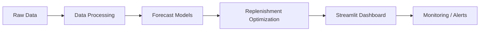

# FORESIGHT: Demand & Inventory Intelligence

FORESIGHT is a production-oriented decision intelligence application for forecasting demand, prioritizing replenishment actions, and monitoring forecast and inventory health.

## What it does

- Runs a Streamlit dashboard for executive decision-making
- Loads processed forecast and replenishment outputs from the `data/processed` folder
- Supports modular architecture for data, ML, optimization, UI, and monitoring components
- Includes Docker, CI/CD, cloud deployment, and monitoring scaffolding

## Project structure

- `app.py` — Streamlit entry point
- `dashboard/` — dashboard data access and UI helpers
- `modules/` — modular package stubs for data, ML, optimization, and UI layers
- `monitoring/` — Prometheus/Grafana starter configuration and metrics helpers
- `scripts/` — validation, load testing, and pipeline utilities
- `tests/` — smoke tests, configuration tests, validation tests, and monitoring tests

## Quick start

### Local Python environment

```powershell
python -m venv .venv
.\.venv\Scripts\Activate.ps1
pip install -r requirements.txt
streamlit run app.py
```

### Docker

```powershell
docker build -t forsight-dashboard:local .
docker run --rm -p 8501:8501 -v "${PWD}\data:/app/data:ro" forsight-dashboard:local
```

### Validation and QA

```powershell
python scripts/validate_forecast_pipeline.py
python scripts/load_test_dashboard.py
python -m pytest
python scripts/run_quality_checks.py
```

## Monitoring

A simple monitoring stack is included under `monitoring/`:

- Prometheus config: `monitoring/prometheus.yml`
- Grafana/Prometheus compose file: `monitoring/docker-compose.monitoring.yml`
- Metrics helpers: `monitoring/metrics.py`

## Deployment notes

Environment variables and deployment scaffolding are available in:

- `.env.example`
- `DEPLOYMENT.md`
- `app.yaml`

## Architecture overview


